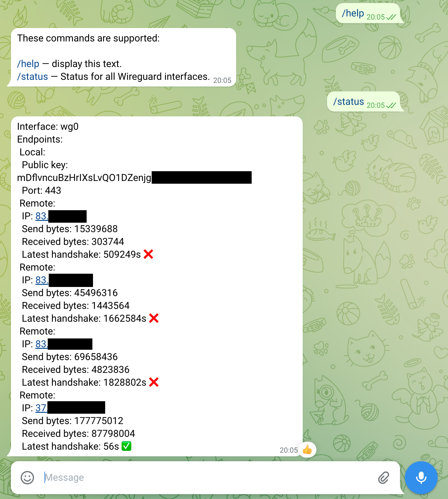

# WireGuard Telegram Bot

[](https://www.rust-lang.org/)
[](https://codecov.io/gh/rogercoll/wireguard-telegram-bot)

Telegram bot that returns the output of the `wg show all dump`. 

    | Command   | Action                  |
    | -------   | ----------------------- |
    | /help     | List supported commands |
    | /status   | Get dump output         |

## Building

Build using cargo

```sh
git clone https://github.com/rogercoll/wireguard-telegram-bot.git
cd wireguard-telegram-bot
cargo build
```

Set the environment variable `TELEGRAM_TOKEN` which you can get from 
@Botfather then run the target binary. Alternatively you can use cargo run<br>
`TELEGRAM_TOKEN="12345:abcdefghijklmnop" cargo run`

## Example output


